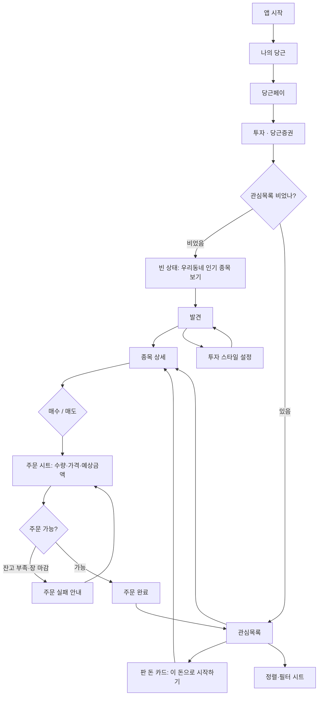

# PRD문서 — 당근 증권 서비스

작성일: 2026.08.01 · 작성자: 최요셉 · 버전: V1.0
포맷: **박소현님 PRD 프로세스(5부 구성)** · 근거: `1-daangn` 자산 **실측**(848 shapes / 217 texts / 5화면)

> 원 템플릿과 다른 점(의도적 강화): 모든 주장에 **자산 원문 인용**을 근거로 달았다.
> 시장 조사 대신 **기존 제품의 IA·어휘·데이터**에서 역산했다 — 심사용 PRD가 바뀌어도 같은 절차가 돈다.

---

## 1. 배경 및 목적

### 1-1. 배경

- 당근마켓 팀이 **증권 서비스**를 준비한다. 대상은 **주식을 처음 시작하는 사람**이다.
- 기존 증권 앱은 *"화면 하나에 숫자가 수십 개씩 들어가 있어서, 무엇을 봐야 할지 모르는 사람은 첫 화면에서 이탈"* 한다. (PRD 1절)
- **핵심 문제는 "정보 과잉"이 아니라 "시작 자체가 안 되는 것"** 이다.
  PRD 3절: *"관심종목이 비어 있으면 아무것도 시작되지 않습니다 → 이게 가장 큰 이탈 지점"*

### 1-2. 목적

- 중고거래로 이미 앱 안에 쌓인 **돈과 신뢰**를 투자의 출발점으로 연결한다.
- 숫자를 늘리지 않고 **"동네 사람들이 뭘 하는지"** 라는 익숙한 판단 근거로 첫 투자를 시작시킨다.

### 1-3. 왜 당근이 증권을 하는가 (자산 IA에서 유추)

PRD는 "무엇을"만 말하고 "왜"를 말하지 않는다. **근거는 기존 자산의 메뉴 트리에 이미 있다.**

| 자산 실측 근거 | 사업 논리 |
|---|---|
| `나의 당근`에 **당근페이** — *"중고거래는 이제 당근페이로 해보세요!"* | 돈이 **앱 안에 머무는 구조**를 이미 만들었다 |
| `모아보기 > **당근가계부**` | 수입·지출 데이터를 **이미 보유** |
| `판매내역` / `구매내역` | 중고거래로 **판 돈이 정기적으로 발생** |
| `관심목록` | 담아두고 지켜보는 행위가 **이미 학습되어 있다** |
| **매너온도 37.2°C** · 모든 항목에 동(洞) 표기 | 금융의 최대 장벽인 **신뢰를 커뮤니티로 이미 해결** |

**⭐ 핵심 경로 — 이 서비스의 존재 이유**

```
중고거래로 판 돈이 당근페이에 남는다 → 가계부에 여윳돈으로 보인다 → 그 돈의 출구가 없다
                                    ↓
              "판 돈으로 투자"  =  다른 증권사가 복제할 수 없는 유입 경로
```

- 타 증권 앱의 시드머니는 **밖에서 이체**해 와야 한다. 당근은 **앱 안에서 발생**한다.
- ⇒ **첫 화면 최상단은 "시장 지수"가 아니라 "이번 달 판 돈"이어야 한다.** (설계 원칙 1)

### 1-4. 타깃 사용자 (퍼소나) — 자산 실측 기반

| 사용자 유형 | 연령대 | 특징 | 주요 사용 목적 | 자산 근거 |
|---|---|---|---|---|
| **주요 사용자** | 20–40대 | 동네 생활권 중심, 중고거래로 소액 현금이 오감 | 판 돈으로 소액 투자 시작 | 거래가 *"4,000원 샌드위치"~"1,000,000원 커피머신"* |
| **보조 사용자** | 30–50대 | 이웃에게 묻고 결정하는 성향 | 동네 사람들이 담은 종목 참고 | *"Q. 혼밥은 다들 어디서 하시나요?"* (동네질문) |

> **한 문장**: 이 사용자는 공시를 읽고 밸류에이션을 계산하는 사람이 아니라,
> **"동네 사람들이 뭘 하는지 보고 소액으로 따라 시작하는 사람"** 이다.

---

## 2. 솔루션 및 기능

### 2-1. 핵심 솔루션

> **중고거래로 번 돈을 그 자리에서 투자로 잇고, 판단 근거를 "우리 동네 이웃"으로 바꿔 첫 진입 장벽을 없앤다.**

### 2-2. 핵심 기능 (Feature List)

| 기능 이름 | 설명 | 우선순위 | 근거 |
|---|---|---|---|
| **관심목록** | 담아둔 종목의 현재가·등락률을 한 화면에서 훑기. 상승/하락 시각 구분, 정렬·필터 | `High` | PRD 6-1 (명시) |
| **판 돈 연결 카드** | 이번 달 중고거래 판매대금 → "이 돈으로 시작하기" | `High` | Why 핵심 경로 (1-3) |
| **종목 상세 + 차트** | 기간 전환 차트, 현재가·등락, 기본 정보 | `High` | PRD 6-2 (명시) |
| **주문 시트** | 수량·가격 입력, 예상 금액, 주문 확정 (**상세 화면 위 오버레이**) | `High` | PRD 6-2 *"별도 화면이 아니라 이 화면 위에"* |
| **종목 발견** | 스타일 기반 추천(이유 한 줄) · 시장 이슈 · 테마 · 전문가 의견 · 실적 일정 | `High` | PRD 6-3 (명시) |
| **우리 동네 관심도** | "우리동네 12명 관심" — 동네 단위 소셜 프루프 | `High` | 자산의 공통 정보축 = 동(洞) |
| **투자 스타일 설정** | 단기수익/배당/성장/안정 + 테마 선택, 추천에 반영 | `Medium` | PRD 4-2·4-3, *"설정 진입점"* |
| **정렬·필터 시트** | 등락률/이름/내 수익률/거래량 | `Medium` | PRD 6-1 *"정렬 또는 필터 진입점"* |
| **빈 상태 온보딩** | 관심목록 0개일 때 발견으로 유도 | `Medium` | PRD *"가장 큰 이탈 지점"* |
| **상태 처리(로딩·주문실패)** | 시세 미수신 / 잔고부족·장마감 | `Medium` | PRD 5절 |
| **동네 종목 토론** | 동네생활 문법의 종목 Q&A | `Low` | 확장 아이디어(자산의 동네생활) |

---

## 3. 서비스 구조

### 3-1. 정보 구조 (IA)

**기존 글로벌 내비게이션 (자산 실측 — 절대 변경하지 않는다)**

| 순서 | 탭 | x좌표(실측) |
|---|---|---|
| 1 | 홈 | 35 |
| 2 | 동네생활 | 100 |
| 3 | 내 근처 | 181 |
| 4 | 채팅 | 264 |
| 5 | **나의 당근** | 332 |

> 증권은 **6번째 탭이 아니다.** 탭을 늘리면 그 순간 다른 제품이 된다.

**신규 기능의 진입 경로**

```
나의 당근  →  당근페이  →  투자(당근증권)
                            ├─ 관심목록   (New/Watchlist)
                            ├─ 종목 상세  (New/StockDetail) ─ 주문 시트(오버레이)
                            └─ 발견       (New/Discover)
```

- 증권 화면에서도 **하단 탭바는 당근 원본 5탭**을 그대로 노출하고 `나의 당근`을 활성 상태로 둔다.
- 증권 3화면 간 이동은 **상단 컨텍스트 바(`‹ 당근페이 · 투자`) + 내부 세그먼트**로 처리한다.

**어휘 사전 (기존 용어 우선 — 신조어 금지)**

| 일반 증권 용어 | 당근에서 쓸 용어 | 근거 |
|---|---|---|
| 관심종목 | **관심목록** | `나의 당근`에 이미 존재 |
| 매수 / 매도 | 매수(사기) / 매도(팔기) 병기 | `구매내역`/`판매내역` 문법 |
| 보유 자산 | 내 투자 | — |
| 인기 종목 | **우리동네 관심 종목** | 모든 항목에 동 단위 표기 |

### 3-2. 사용자 흐름 (User Flow)

앱 시작 → 나의 당근 → 당근페이 → **투자** → (판 돈 카드 확인) → 관심목록 →
종목 선택 → 종목 상세(차트·정보) → 매수 → **주문 시트** → 주문 확정 → 결과 확인



---

## 4. 디자인 전략

### 4-1. 레퍼런스 분석 — **무엇을 왜 차용하는가**

| 레퍼런스 | 카테고리 | 차용 대상 | 왜 |
|---|---|---|---|
| **당근마켓 (기존 자산)** | 중고거래·동네 커뮤니티 | 하단 5탭 IA · 리스트 행 구조(썸네일 72 + 2줄) · 매너온도식 단일 지표 · 동 단위 표기 · 어휘 | PRD 조건: *"다른 제품처럼 보이면 안 됩니다"*. **자산이 유일한 SSOT** |
| 당근 `동네생활` | 커뮤니티 피드 | "우리동네 N명 관심" 소셜 프루프 문법 | 초보자의 판단 근거를 **이웃**으로 치환 (퍼소나 결론) |
| 당근 `당근페이` | 결제 | 진입 경로·잔액 카드 위치 | Why 핵심 경로의 시각화 |
| 일반 증권 앱 | 금융 | 차트+기간탭, 하단 고정 매수/매도, 컨센서스 분포 바 | PRD 6-2·6-3 명시 요소. **단 레이아웃만 차용하고 색·타이포는 당근 토큰** |

### 4-2. GUI 방향성 및 전략

**디자인 톤 & 매너**: 익숙함 · 저밀도 · 단일 강조색

| 원칙 | 내용 | 왜 |
|---|---|---|
| 1 | **첫 화면 최상단 = 판 돈** | Why 핵심 경로. 시장 지수로 시작하면 그냥 증권앱 |
| 2 | **한 행에 숫자 2개까지** | *"숫자가 수십 개씩 … 첫 화면에서 이탈"* |
| 3 | **강조색은 `#FF7E36` 하나** | 자산 실측 1위(면적가중 19,571). 새 색 도입 금지 |
| 4 | **상승/하락도 자산 팔레트로** | 관습(빨강/파랑) 대신 `up=#FF7E36` / `down=#4AC1DB`. 색 이외에 **부호+삼각형** 병용 |
| 5 | **생활어** | *"부담 없고 익숙한 경험"* — 전문용어 대신 |

**금지**: 새 브랜드 컬러 · 단정형 추천("지금 사세요") · 공포/긴급 유도(카운트다운·붉은 경고) · 한 행 숫자 3개 이상

**토큰**(자산 실측 — 상세는 `02-tokens.md`)
`artboard 390×844` · `accent #FF7E36` · `text #000000` · `textSub #8C8C8C` · `divider #EEEEEE`
`Inter`(라틴) + `Pretendard`(한글) · `radius 4` 지배 · `space 4/8/12/16` · `rowHeight 72`

---

## 5. 구현 전 기술 스펙 체크

> 이번 과제 산출물은 디자인이지만, **"AI 에이전트가 읽고 이어서 작업할 수 있는 데이터"** 가 최종 기준이므로
> 핵심 기능의 데이터 계약만 명시한다.

### 1. 관심목록
- **DB**: `Watchlist(user_id, ticker, added_at, sort_pref)` · `Quote(ticker, price, change_rate, updated_at)`
- **API**: `GET /watchlist?sort=change|name|profit|volume` · `POST /watchlist/{ticker}`
- **실시간**: 시세는 WebSocket 푸시, **미수신 구간(장 시작 직후 수 초)의 로딩 상태 필수** (PRD 5절)

### 2. 판 돈 연결 카드
- **DB**: 기존 `PayBalance(user_id, balance)` + `SalesLedger(user_id, month, sold_amount)` (중고거래 판매대금)
- **API**: `GET /pay/investable-summary` → `{ month_sold, balance, investable }`
- **주의**: 판매대금과 일반 잔액을 **구분**해 표기해야 카피가 성립

### 3. 종목 상세 · 차트
- **DB**: `PriceSeries(ticker, interval, points[])` (1D/1W/1M/1Y/5Y)
- **API**: `GET /stocks/{ticker}` · `GET /stocks/{ticker}/series?interval=1D`

### 4. 주문
- **DB**: `Order(user_id, ticker, qty, price, type, status)`
- **API**: `POST /orders` → 실패 코드 `INSUFFICIENT_FUNDS` · `MARKET_CLOSED` (PRD 5절 실패 케이스와 1:1)
- **결제**: 당근페이 잔액 차감 연동

### 5. 우리 동네 관심도
- **DB**: `RegionInterest(region_code, ticker, user_count)` — 동(洞) 단위 집계
- **API**: `GET /region/{code}/interest?ticker=`
- **주의**: 소수 인원 노출 시 **개인 식별 위험** → 최소 집계 인원(예: 5명) 미만은 비노출

### 6. 추천 (스타일 기반)
- **DB**: `UserStyle(user_id, style, themes[])` · `Recommendation(user_id, ticker, reason_text)`
- **API**: `GET /recommendations` → **반드시 `reason_text` 동반**(PRD: 추천 이유 한 줄 필수)
- **알고리즘**: 스타일(변동성/배당/성장/안정) 필터 + 테마 매칭 + 당일 지표

---

## 다음 단계가 이 문서에서 뽑아 쓸 것
- ① 화면 인벤토리: §2-2 Feature List의 `High` = **P0 후보**
- ③ 톤·Why·IA 전략: §1-3 · §3-1 · §4
- ④ 화면 스펙: §3-1 어휘 사전 · §4-2 원칙 1~5
- ⑥ QA: §4-2 **금지** 항목 = 감점 체크리스트
